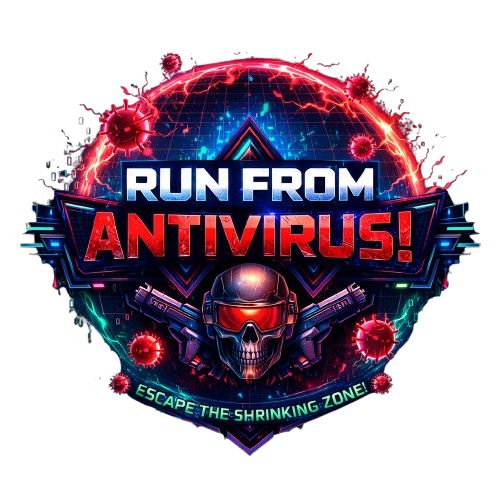

<h1>Run from antivirus!</h1>

Для запуска с ОС Windows:
1. Скачайте релиз репозитория
2. Распакуйте архив в директорию игры
3. Запустите файл start.bat

Для запуска с ОС Linux:
1. Скачайте релиз репозитория
2. Распакуйте архив в директорию игры
3. В терминале присвойте права исполнения файлу start.sh (chmod +x start.sh)
4. Запустите файл start.sh (./start.sh)
5. ВАЖНО! При очередном запуске игры на другом дисплее (который вы выбрали в диалоговом окне) необходимо курсор мыши увести на этот монитор. Свойственно как для x11, так и для wayland (на windows не обязательно держать курсор на целевом мониторе)

Авторы:
 <ul>
    <li>Никита Конжин</li>
    <li>Андрей Нефедов</li>
    <li>Егор Селезнев</li>
</ul>

Создано в качестве проекта учениками образовательной программы "Яндекс.Лицей"